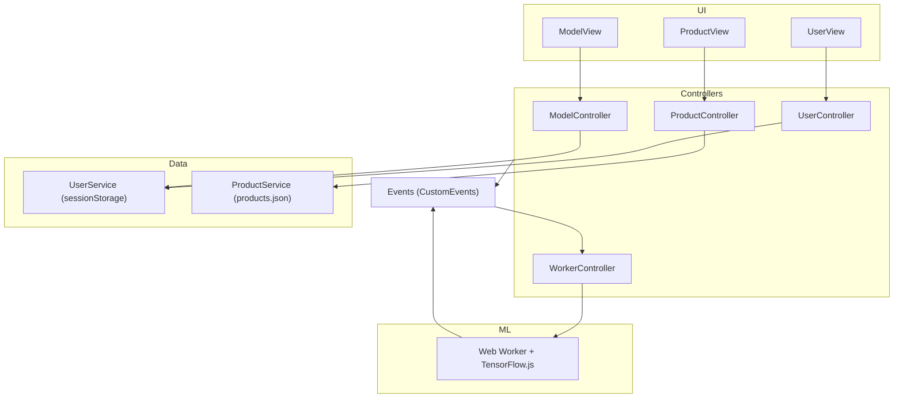

## Visão geral

O `example-01-ecommerce-recomendations` é uma aplicação web de e-commerce que simula perfis de usuários, histórico de compras e um **motor de recomendação com TensorFlow.js**. A arquitetura segue um padrão **MVC** (Model/View/Controller) com comunicação **orientada a eventos** entre os módulos.

Para rodar: `npm install` → `npm start` → abrir `http://localhost:3000`.

---

## Arquitetura



| Camada         | Responsabilidade                                      |
| -------------- | ----------------------------------------------------- |
| **View**       | DOM, templates HTML, botões                           |
| **Controller** | Orquestra views e services, dispara eventos           |
| **Service**    | Dados: usuários em `sessionStorage`, produtos em JSON |
| **Events**     | Barramento de eventos (`CustomEvent` no `document`)   |
| **Worker**     | Treino e inferência ML sem travar a UI                |

---

## Inicialização (`src/index.js`)

Na carga da página:

1. Cria **services**, **views** e um **Web Worker** (`modelTrainingWorker.js`).
2. O `WorkerController` conecta mensagens do worker aos eventos da aplicação.
3. Carrega usuários de `data/users.json` e **treina o modelo automaticamente** com esses dados.
4. Inicializa todos os controllers.
5. Adiciona um usuário especial **"Josézin da Silva"** (id 99, sem compras) — pensado para testar recomendações para quem não tem histórico.

---

## Fluxo de dados dos usuários

O `UserService` carrega `users.json` uma vez e persiste alterações no **`sessionStorage`** (chave `ew-academy-users`):

- Selecionar usuário → mostra idade e compras passadas.
- Clicar em **"Buy Now"** → adiciona produto ao histórico do usuário selecionado.
- Clicar em uma compra passada → remove essa compra.

Cada mudança dispara `usersUpdated`, que atualiza o painel **"All Users Purchase Data"** no card de treino.

---

## Fluxo de produtos

1. `ProductController` carrega todos os produtos de `data/products.json`.
2. Botões **"Buy Now"** ficam desabilitados até um usuário ser selecionado.
3. Ao selecionar usuário:
   - Habilita os botões.
   - Se o modelo já foi treinado, dispara recomendação automática.
4. Quando as recomendações chegam, a lista de produtos é **reordenada por score** do modelo.

---

## Fluxo de ML (o coração do exemplo)

### 1. Treinamento (automático ou botão "Train Model")

O worker (`modelTrainingWorker.js`) faz:

**Codificação de features** — produtos e usuários viram vetores numéricos:

| Feature   | Peso | Como é codificada |
| --------- | ---- | ----------------- |
| Categoria | 0.4  | one-hot           |
| Cor       | 0.3  | one-hot           |
| Preço     | 0.2  | normalizado 0–1   |
| Idade     | 0.1  | normalizada 0–1   |

- **Produto**: preço + idade média dos compradores + categoria + cor.
- **Usuário com compras**: média dos vetores dos produtos comprados.
- **Usuário sem compras** (ex.: Josézin): só a idade normalizada; resto é zero.

**Dados de treino**: para cada usuário com compras, gera pares `(vetor_usuário + vetor_produto)` com label `1` se comprou e `0` se não.

**Rede neural** (TensorFlow.js):

```
Entrada → Dense(128, relu) → Dense(64, relu) → Dense(32, relu) → Dense(1, sigmoid)
```

Treina por 100 épocas com `binaryCrossentropy`. Logs de loss/accuracy são enviados à thread principal (para o TF.js Vis, se configurado).

### 2. Recomendação

Quando um usuário é selecionado (ou ao clicar **"Run Recommendation"**):

1. Codifica o usuário atual.
2. Concatena com o vetor de **cada produto**.
3. Roda `model.predict()` em todos os pares.
4. Ordena produtos por score (0–1).
5. Devolve a lista ordenada para a UI.

---

## Comunicação por eventos

Os módulos não se chamam diretamente; usam a classe `Events`:

| Evento                 | Quando dispara                                    |
| ---------------------- | ------------------------------------------------- |
| `userSelected`         | Usuário escolhido no dropdown                     |
| `purchaseAdded`        | Clique em "Buy Now"                               |
| `usersUpdated`         | Compra adicionada/removida                        |
| `modelTrain`           | Botão "Train Model"                               |
| `trainingComplete`     | Worker terminou o treino                          |
| `recommend`            | Usuário selecionado ou botão "Run Recommendation" |
| `recommendationsReady` | Worker devolveu scores                            |

O `WorkerController` faz a ponte entre o worker e esses eventos.

---

## Caso de uso típico para testar

1. Abra a app — o modelo treina sozinho com os usuários do JSON.
2. Selecione **"Josézin da Silva"** (sem compras) → produtos reordenados pela idade dele.
3. Compre alguns produtos → histórico atualiza e o perfil muda.
4. Clique **"Run Recommendation"** → nova ordenação com base nas compras.
5. Clique **"Train Model"** → retreina com todos os usuários (incluindo novas compras).
6. Expanda **"All Users Purchase Data"** para ver o dataset usado no treino.

---

## Resumo

É um e-commerce didático que mostra como integrar **TensorFlow.js em um Web Worker** numa arquitetura web clássica (MVC + eventos). O ML aprende padrões de compra (categoria, cor, preço, idade) e ranqueia produtos para cada perfil. Usuários e compras ficam em `sessionStorage`; produtos vêm de JSON estático.

Se quiser, posso comparar este exemplo com o `module01/exercise/` que você está trabalhando, ou detalhar só a parte do worker/neural net.
