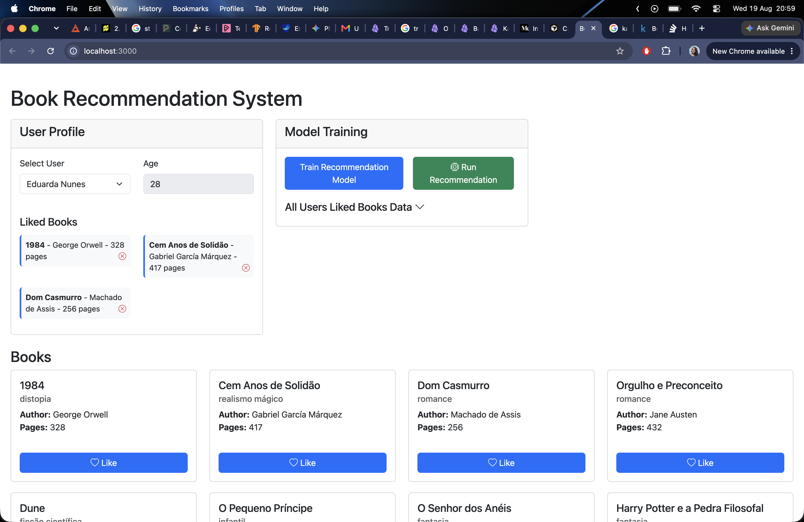

# Book Recommendation System

Sistema de recomendação de livros com TensorFlow.js, baseado no example-01 de e-commerce.



## Diferenças em relação ao example-01

| Example 01 (E-commerce) | Exercise (Livros)    |
| ----------------------- | -------------------- |
| Products                | Books                |
| Buy / Purchases         | Like / Liked         |
| category, color, price  | genre, author, pages |

## Como executar

```bash
npm install
npm start
```

Acesse `http://localhost:3000`.

## Fluxo

1. Selecione um usuário
2. Curta livros clicando em **Like**
3. Treine o modelo com **Train Model**
4. Execute **Run Recommendation** para ver livros recomendados

O usuário "Josézin da Silva" (id: 99) não está nos dados de treinamento — use-o para testar recomendações em um perfil novo.
